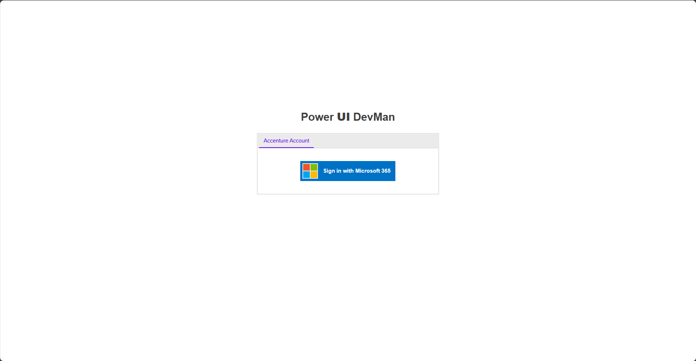
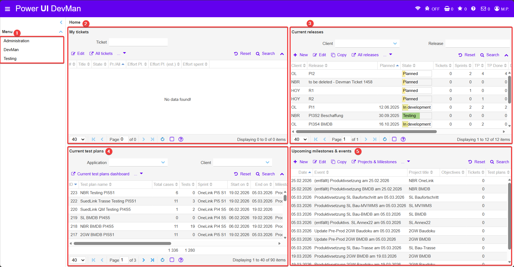

## Intro

  
  <!-- BEGIN ImageCaptionNr: -->
Abbildung 1:
<!-- END ImageCaptionNr -->Anmeldung

  
  <!-- BEGIN ImageCaptionNr: -->
Abbildung 1:
<!-- END ImageCaptionNr -->Hauptseite Übersicht

#### 1

#### 2

#### 3

#### 4

#### 5
