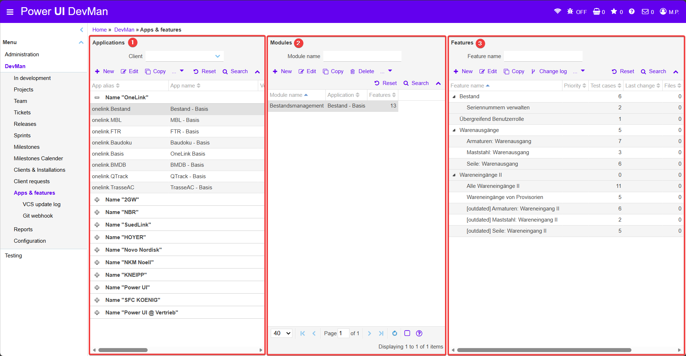
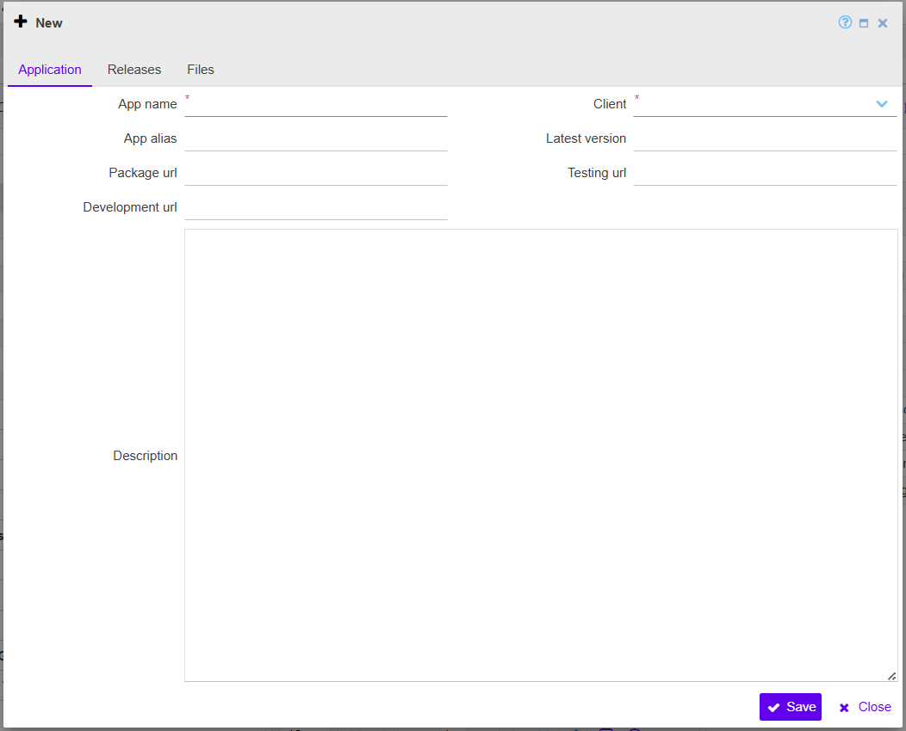
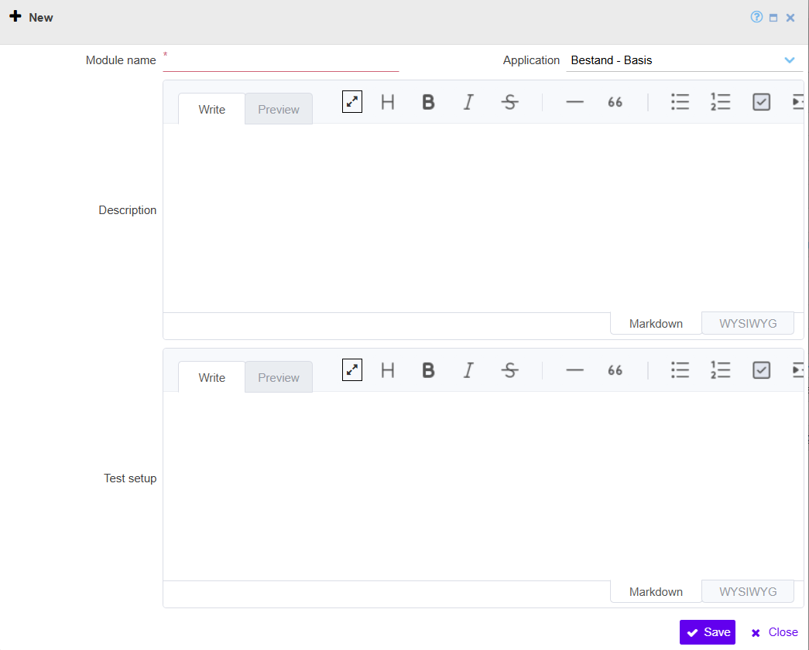
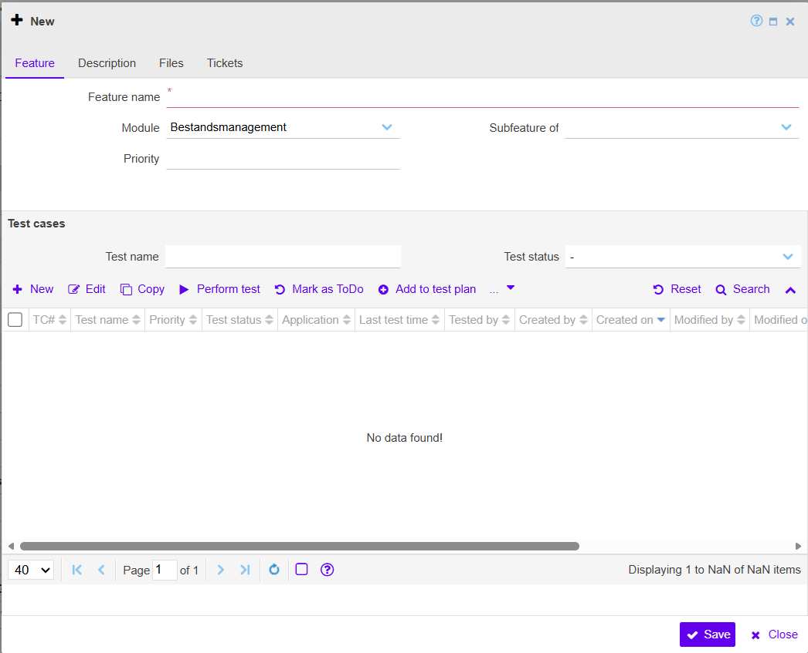
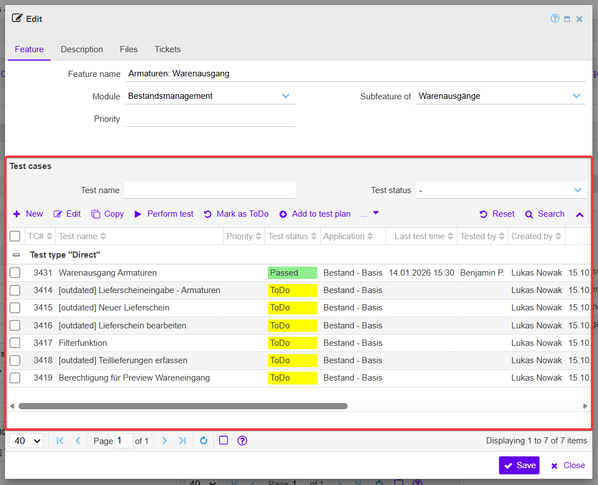

### Apps & Features

  
  <!-- BEGIN ImageCaptionNr: -->
Abbildung 1:
<!-- END ImageCaptionNr -->DevMan: Apps & Features

  
  <!-- BEGIN ImageCaptionNr: -->
Abbildung 1:
<!-- END ImageCaptionNr -->Apps: New

  
  <!-- BEGIN ImageCaptionNr: -->
Abbildung 1:
<!-- END ImageCaptionNr -->Modules: New

  
  <!-- BEGIN ImageCaptionNr: -->
Abbildung 1:
<!-- END ImageCaptionNr -->Features: New

  
  <!-- BEGIN ImageCaptionNr: -->
Abbildung 1:
<!-- END ImageCaptionNr -->Features: Edit

