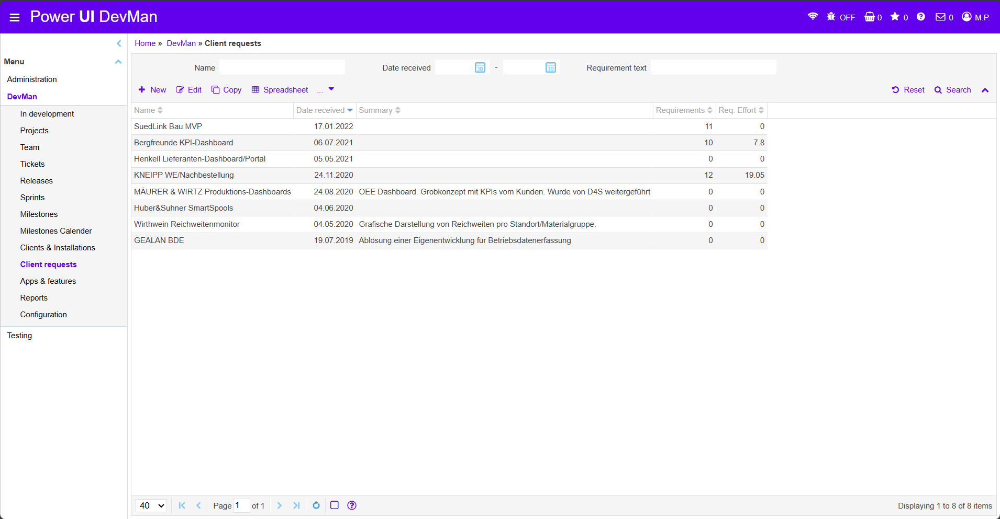
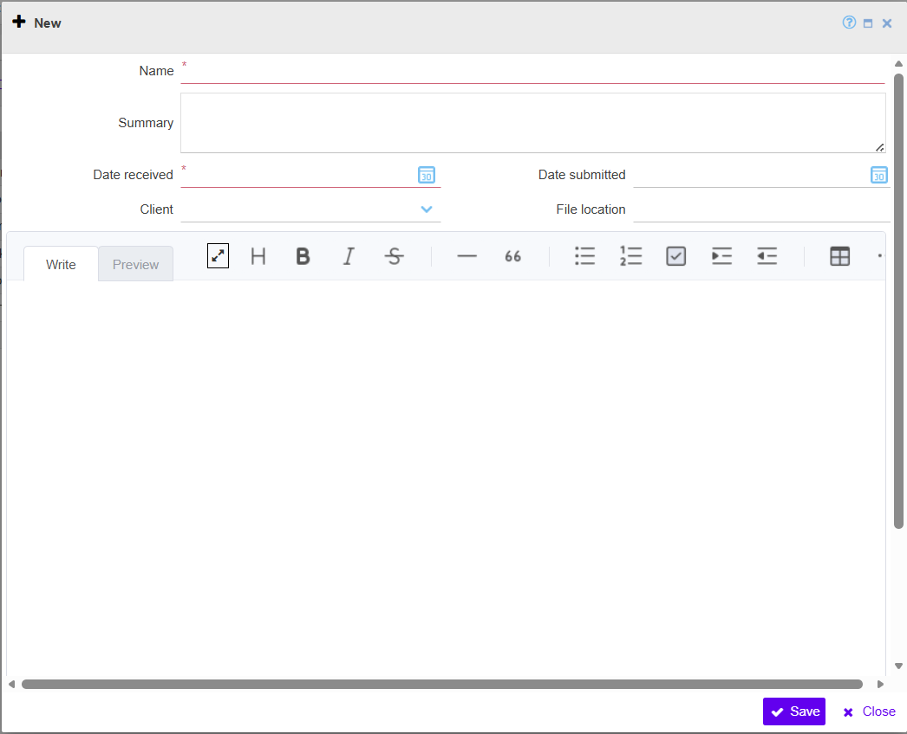
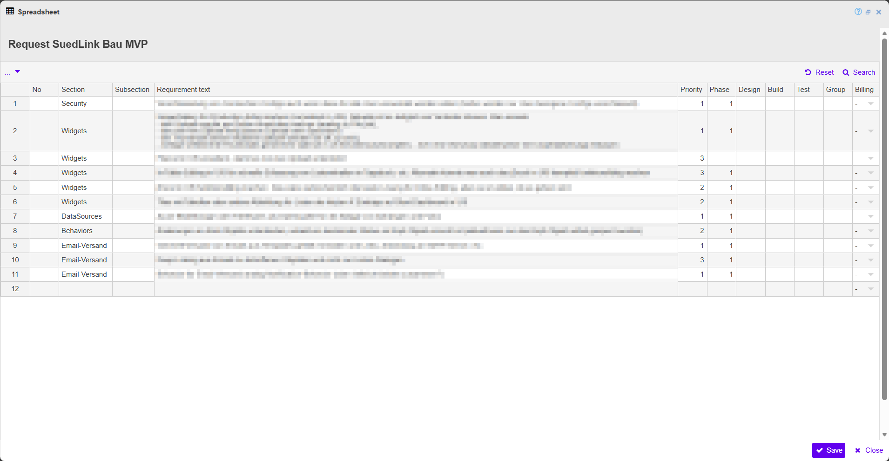

### Client Requests

  
  <!-- BEGIN ImageCaptionNr: -->
Abbildung 1:
<!-- END ImageCaptionNr -->DevMan: Client requests

  
  <!-- BEGIN ImageCaptionNr: -->
Abbildung 1:
<!-- END ImageCaptionNr -->Client requests: New

  
  <!-- BEGIN ImageCaptionNr: -->
Abbildung 1:
<!-- END ImageCaptionNr -->Client requests: Spreadsheet

