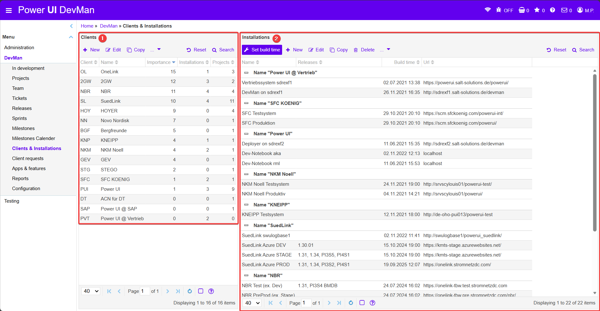
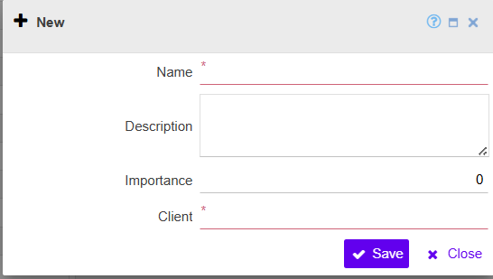
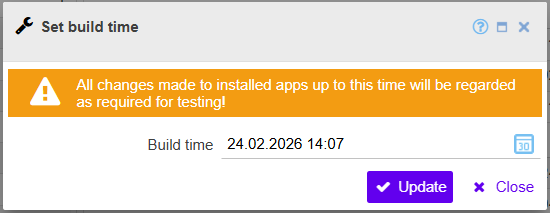
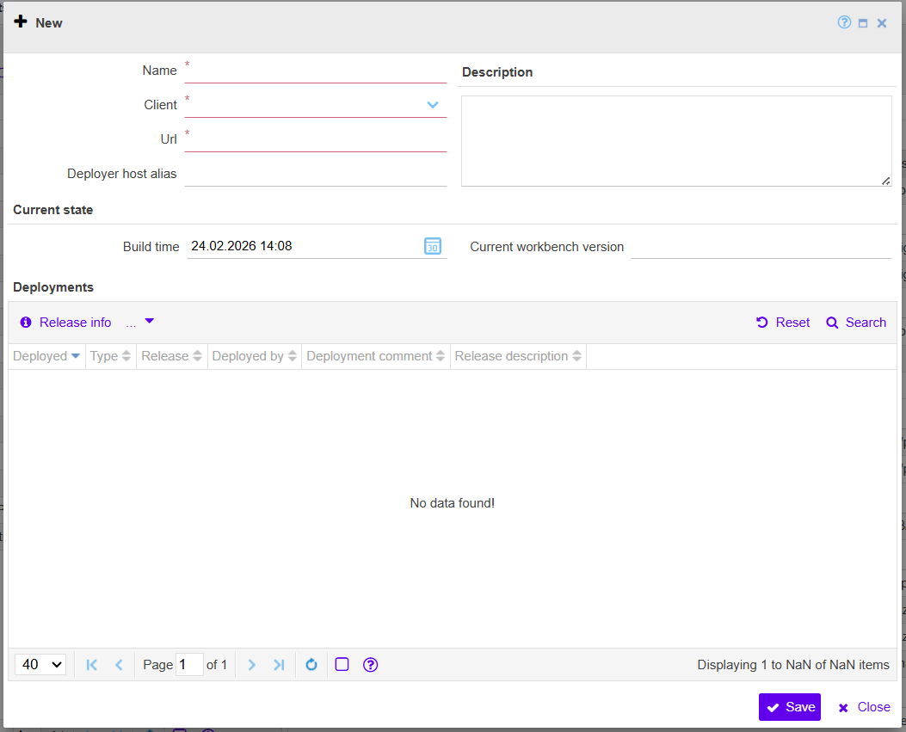

### Clients & Installations

  
  <!-- BEGIN ImageCaptionNr: -->
Abbildung 1:
<!-- END ImageCaptionNr -->DevMan: Clients & Installations

  
  <!-- BEGIN ImageCaptionNr: -->
Abbildung 1:
<!-- END ImageCaptionNr -->Clients: New

  
  <!-- BEGIN ImageCaptionNr: -->
Abbildung 1:
<!-- END ImageCaptionNr -->Installations: Set build time

  
  <!-- BEGIN ImageCaptionNr: -->
Abbildung 1:
<!-- END ImageCaptionNr -->Installations: New

