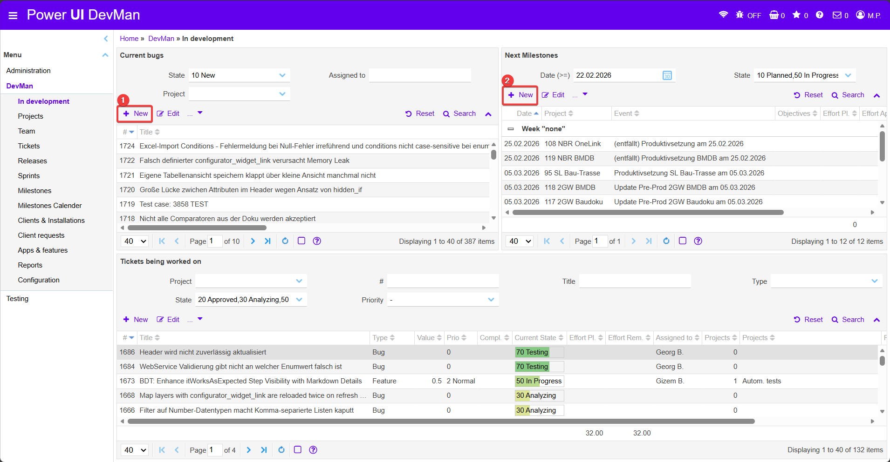
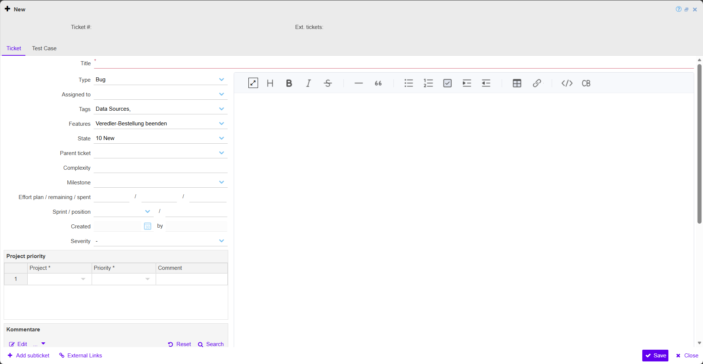
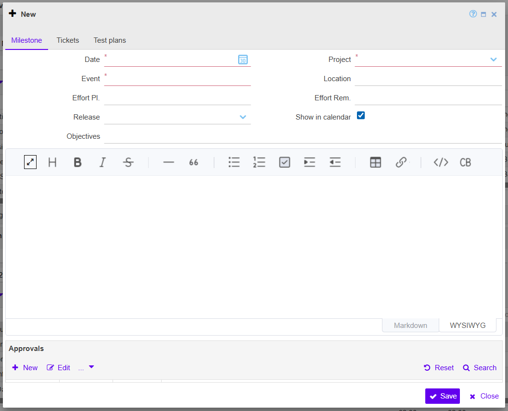

### In Development

  
  <!-- BEGIN ImageCaptionNr: -->
Abbildung 1:
<!-- END ImageCaptionNr -->DevMan: In Development

  
  <!-- BEGIN ImageCaptionNr: -->
Abbildung 1:
<!-- END ImageCaptionNr -->Bugs: New

  
  <!-- BEGIN ImageCaptionNr: -->
Abbildung 1:
<!-- END ImageCaptionNr -->Milestones: New

