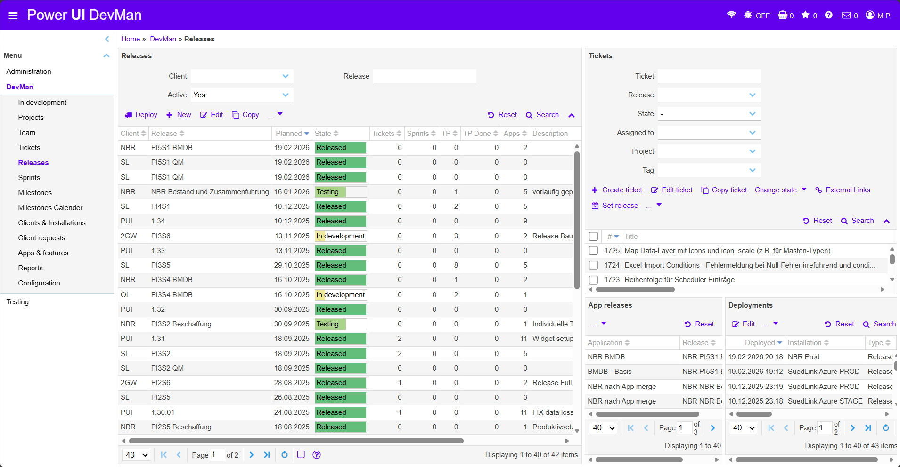

### 2.5 Releases

<!-- BEGIN ImageRef:image-id=2_DevMan-releases-image-1 --><!-- END ImageRef --> zeigt die Seite Releases im Bereich DevMan:

  
  <!-- BEGIN ImageCaptionNr: -->
Abbildung 1:
<!-- END ImageCaptionNr -->DevMan: Releases

In diesem Bereich werden Releases projektspezifisch verwaltet und überwacht. Die Seite bietet eine Übersicht über vorhandene Releases, deren Status sowie die zugehörigen Tickets und Deployments.

Der Zeitraum sowie die Struktur der Releases werden projektspezifisch festgelegt. Je nach Projekt können Releases beispielsweise in festen Intervallen geplant oder an bestimmte Entwicklungsstände gekoppelt sein.

Die Seite ist in mehrere Funktionsbereiche gegliedert.

#### 1 Releases

Im linken Bereich befindet sich die Übersicht aller vorhandenen Releases. Über die Suchfelder kann die Liste nach Client oder Release gefiltert werden. Der Status eines Releases zeigt den aktuellen Fortschritt im Entwicklungsprozess, beispielsweise In development, Testing oder Released.

#### 2 Tickets

Im rechten oberen Bereich werden Tickets angezeigt, die einem Release zugeordnet sind oder diesem zugeordnet werden können.

Tickets können hier erstellt, bearbeitet oder einem Release zugewiesen werden. Zusätzlich stehen Funktionen zur Statusänderung oder zum Kopieren von Tickets zur Verfügung.

Die detaillierte Verwaltung von Tickets ist in Kapitel **2.4 Tickets** beschrieben.

#### 3 App Releases

Dieser Bereich zeigt Anwendungen, die Teil eines Releases sind. Dadurch wird sichtbar, welche Anwendungen oder Komponenten im jeweiligen Release berücksichtigt werden.

#### 4 Deployments

Im Bereich Deployments werden durchgeführte Deployments angezeigt. Die Übersicht enthält unter anderem Informationen zum Zeitpunkt des Deployments sowie zur Zielumgebung.

Dadurch lässt sich nachvollziehen, wann ein Release in welche Umgebung ausgeliefert wurde.