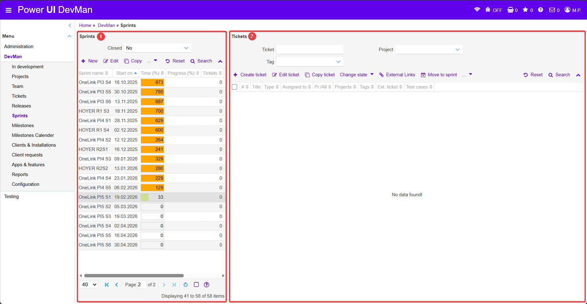
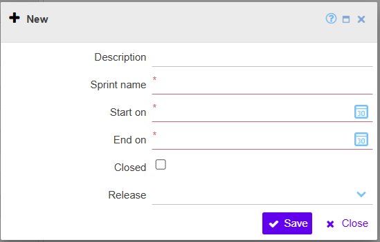

### 2.6 Sprints

In diesem Bereich werden Sprints verwaltet und deren Fortschritt überwacht. Sprints strukturieren die Entwicklungsarbeit innerhalb eines bestimmten Zeitraums und bündeln die Tickets, die in dieser Phase bearbeitet werden.

Die Länge und Planung der Sprints wird projektabhängig festgelegt. Je nach Projekt können unterschiedliche Sprintzyklen verwendet werden.

  
  <!-- BEGIN ImageCaptionNr: -->
Abbildung 1:
<!-- END ImageCaptionNr -->DevMan: Sprints

Im linken Bereich wird eine Übersicht aller vorhandenen Sprints angezeigt. Der Fortschrittsbalken zeigt den aktuellen Stand des Sprints im Verhältnis zur geplanten Laufzeit. Über die Aktionsleiste oberhalb der Tabelle können neue Sprints erstellt oder bestehende Sprints bearbeitet werden.

Beim Anlegen eines Sprints werden zunächst die grundlegenden Zeitinformationen festgelegt. Dazu gehören insbesondere der Name des Sprints, das Startdatum sowie das Enddatum. Optional kann ein Sprint direkt einem Release zugeordnet werden. Dadurch wird der Sprint in die Releaseplanung integriert. Über das Feld Closed kann ein Sprint als abgeschlossen markiert werden. Nach Abschluss eines Sprints können keine neuen Tickets mehr zugeordnet werden. Der Sprint wird anschließend über Save gespeichert.

  
  <!-- BEGIN ImageCaptionNr: -->
Abbildung 1:
<!-- END ImageCaptionNr -->Sprints: New

Der rechte Bereich zeigt Tickets, die einem Sprint zugeordnet sind oder diesem zugeordnet werden können. Hier können Tickets erstellt, bearbeitet oder in einen Sprint verschoben werden. Zusätzlich kann der Status eines Tickets angepasst werden.