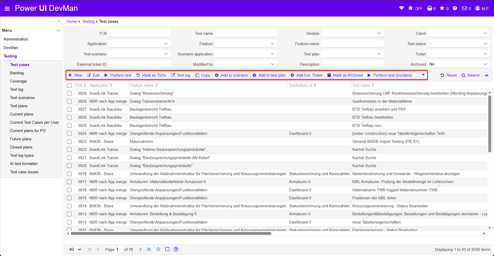
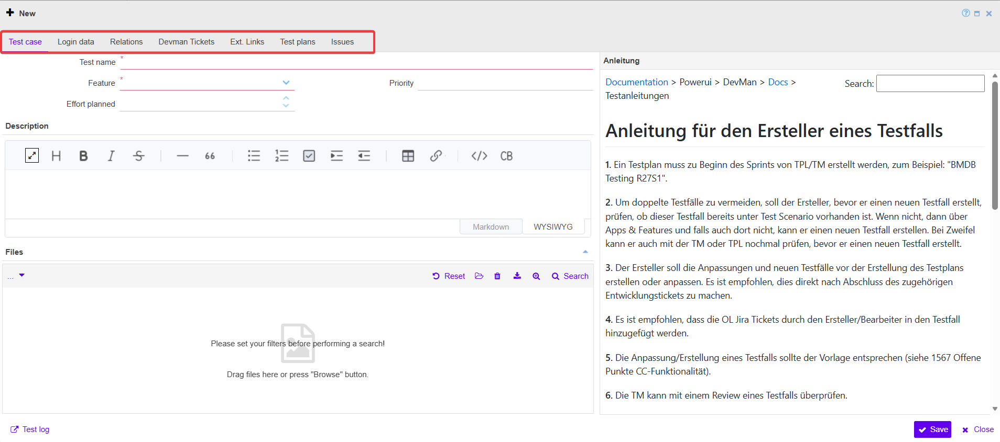
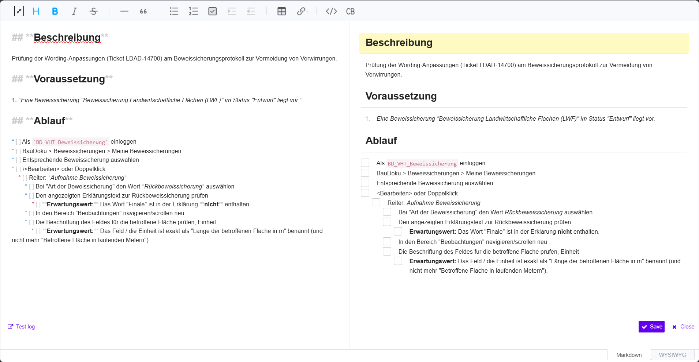
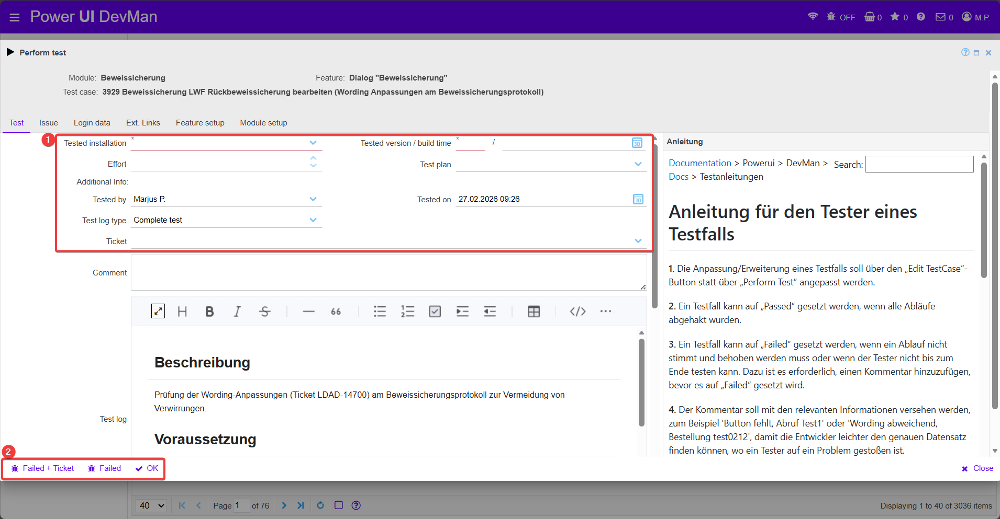
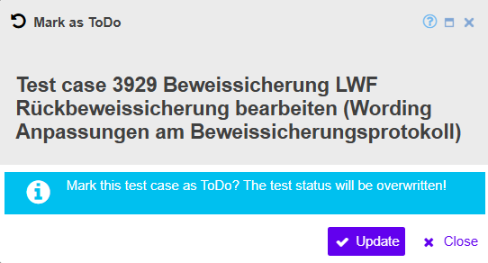
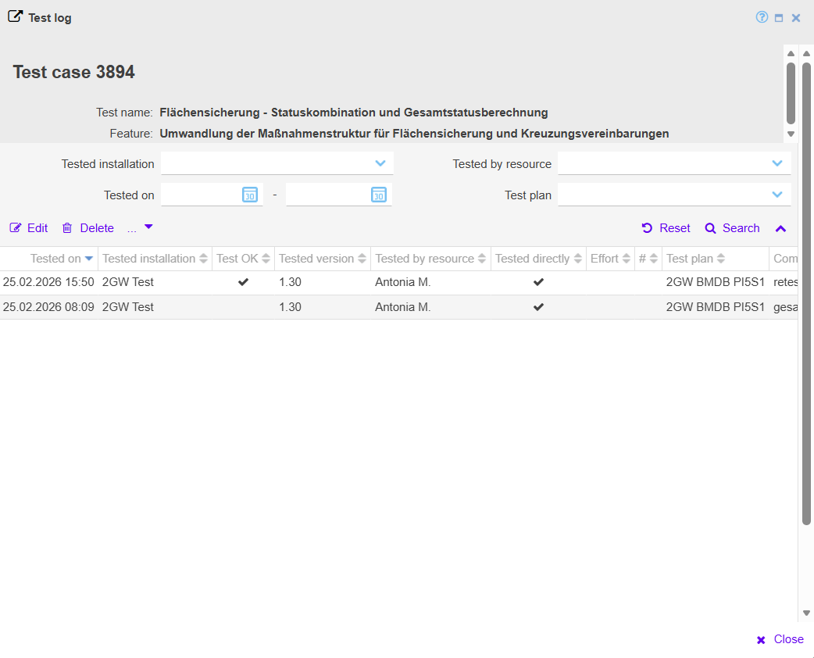
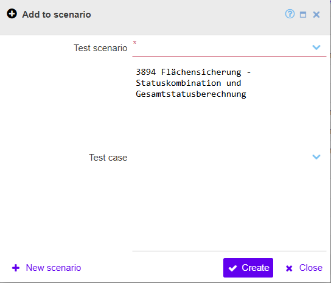
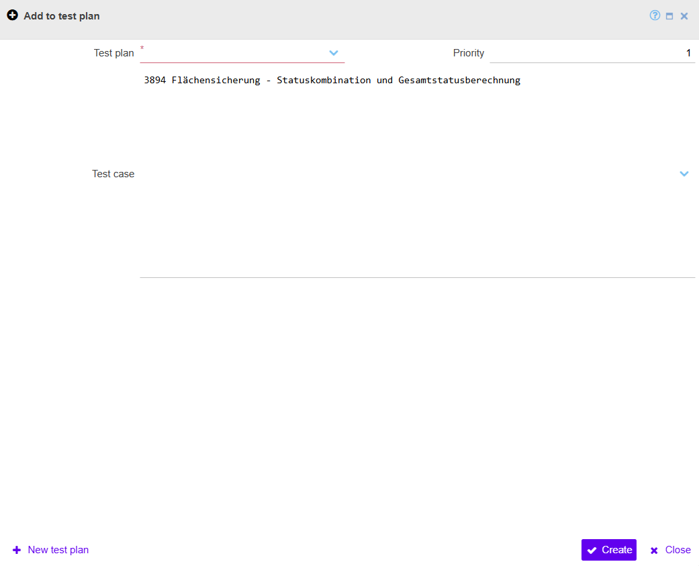
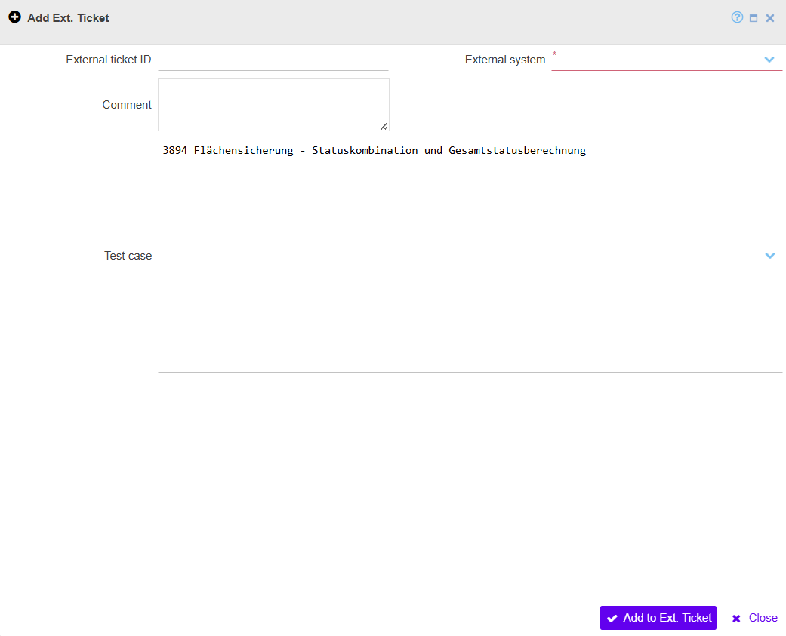
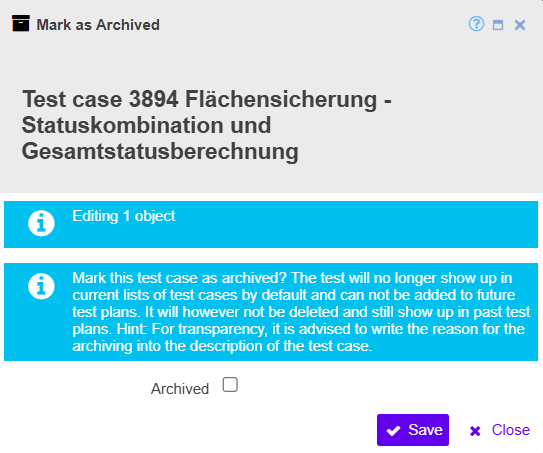

### 3.1 Test cases

Auf dieser Seite werden alle vorhandenen Testfälle verwaltet. Test cases bilden die Grundlage für die Durchführung und Dokumentation von Tests innerhalb eines Projekts. Jeder Testfall ist dabei einer App, einem Feature und optional weiteren Strukturen wie Testplänen oder Testscenarios zugeordnet.

Über die Filter im oberen Bereich kann die Liste der Testfälle nach verschiedenen Kriterien eingeschränkt werden, beispielsweise nach Test name, Application, Feature, Module, Client, Test status oder Test plan. Dadurch können relevante Testfälle schnell gefunden werden.

Unterhalb der Filter befindet sich die Aktionsleiste mit verschiedenen Funktionen zur Verwaltung von Testfällen.

  
  <!-- BEGIN ImageCaptionNr: -->
Abbildung 1:
<!-- END ImageCaptionNr -->Testing: Test Cases

Ein Testfall enthält grundlegende Informationen zum zu testenden Verhalten. Dazu gehören insbesondere der Test name, das zugehörige Feature, die Priorität sowie der geplante Testaufwand.

  
  <!-- BEGIN ImageCaptionNr: -->
Abbildung 1:
<!-- END ImageCaptionNr -->Test Cases: New

Bei der Ausführung eines Testfalls werden zunächst Informationen zur Testumgebung und zum Testkontext erfasst. Während der Durchführung wird der Ablauf des Testfalls angezeigt. Tester können dabei direkt im Testprotokoll Kommentare oder zusätzliche Informationen hinterlegen.

Am Ende der Testdurchführung kann der Testfall mit einem Status abgeschlossen werden:

- OK: Test erfolgreich durchgeführt

- Failed: Test fehlgeschlagen

- Failed + Ticket: Test fehlgeschlagen und ein Ticket wird erstellt

Die eigentliche Testbeschreibung wird im Beschreibungsbereich gepflegt. Für die Bearbeitung stehen dabei zwei Ansichten zur Verfügung. In der Markdown-Ansicht wird der Inhalt in strukturierter Schreibform gepflegt und diese Ansicht eignet sich in der Regel besser für das eigentliche Schreiben und Überarbeiten des Testfalls. In der Ansichtsvorschau beziehungsweise der formatierten Sicht wird dargestellt, wie der Testfall später in der Ausführung angezeigt wird. Je nach persönlicher Präferenz kann in beiden Ansichten gearbeitet werden. Die Vorschau eignet sich insbesondere zur Kontrolle, ob Überschriften, Schritte und Formatierungen wie gewünscht dargestellt werden.

Inhaltlich wird der Testfall üblicherweise in Bereiche wie Beschreibung, Voraussetzung und Ablauf gegliedert [siehe Confluence-Seite](https://asgixpo.atlassian.net/wiki/spaces/wartunglogbase/pages/1298694223/TCs+erstellen).

  
  <!-- BEGIN ImageCaptionNr: -->
Abbildung 1:
<!-- END ImageCaptionNr -->Test Cases: Markdown

<!-- BEGIN ImageRef:image-id=3_Testing-tc-image-4 --><!-- END ImageRef --> zeigt die Oberfläche zur Durchführung eines Testfalls über Perform test.

Die Testdurchführung beginnt über die Aktion Perform test in der Aktionsleiste. Nach dem Öffnen der Maske werden zunächst die Kopfinformationen gepflegt. Dazu gehören insbesondere die getestete Installation, die getestete Version bzw. der Build-Zeitpunkt, der zugehörige Test plan, der Tester sowie weitere kontextbezogene Angaben.

Anschließend wird die Testbeschreibung aufgerufen. Für die eigentliche Durchführung ist es sinnvoll, den Beschreibungsbereich zu maximieren, damit der Ablauf vollständig und gut lesbar angezeigt wird. Die einzelnen Schritte des Testfalls werden dann nacheinander durchgeführt und Schritt für Schritt über die Auswahlfelder bestätigt. Auf diese Weise lässt sich der Test strukturiert entlang der dokumentierten Beschreibung abarbeiten.

Wenn während der Durchführung kein Fehler festgestellt wird, kann der Test mit OK abgeschlossen werden. Tritt ein Fehler auf, wird der Test mit Failed beendet. In diesem Fall sollte im Kommentarfeld eine nachvollziehbare Fehlerbeschreibung ergänzt werden. Sinnvoll sind dabei konkrete Hinweise wie der betroffene Navigationspfad, die getestete Datensatz-ID, der Name des Datensatzes oder andere Informationen, die eine spätere Nachstellung erleichtern.

Für Fehler, die nicht kurzfristig innerhalb des laufenden Sprints behoben werden können oder für eher technische Themen, kann nach Abstimmung im Team oder mit den TPLs die Funktion Failed + Ticket verwendet werden. Dadurch wird der Fehler nicht nur im Test dokumentiert, sondern zusätzlich als Ticket zur weiteren Bearbeitung übergeben.

  
  <!-- BEGIN ImageCaptionNr: -->
Abbildung 1:
<!-- END ImageCaptionNr -->Test Cases: Testing ablauf

Durch "Mark as ToDo" kann der Status eines Testfalls wieder auf ToDo zurückgesetzt werden. Dabei wird der bisherige Teststatus überschrieben. Die Funktion ist insbesondere dann relevant, wenn ein Testfall erneut offen bewertet werden soll, beispielsweise nach Änderungen an der Funktion, nach einer Überarbeitung des Testfalls oder wenn ein bereits bewerteter Test erneut getestet werden muss.

  
  <!-- BEGIN ImageCaptionNr: -->
Abbildung 1:
<!-- END ImageCaptionNr -->Test Cases: Mark as ToDo

Im Test log werden alle bisherigen Testausführungen eines Testfalls protokolliert. Die Übersicht enthält unter anderem Informationen zur Testinstallation, zur getesteten Version, zum Tester sowie zum Zeitpunkt der Durchführung.

  
  <!-- BEGIN ImageCaptionNr: -->
Abbildung 1:
<!-- END ImageCaptionNr -->Test Cases: Test log

Über die Funktionen Add to scenario und Add to test plan können Testfälle bestehenden Testscenarios oder Testplänen zugeordnet werden.

Beim Hinzufügen zu einem Testplan wird zusätzlich eine Priorität für den Testfall innerhalb des Plans festgelegt. Dadurch kann gesteuert werden, in welcher Reihenfolge Testfälle innerhalb eines Testplans ausgeführt werden.

  
  <!-- BEGIN ImageCaptionNr: -->
Abbildung 1:
<!-- END ImageCaptionNr -->Test Cases: Add to scenario

  
  <!-- BEGIN ImageCaptionNr: -->
Abbildung 1:
<!-- END ImageCaptionNr -->Test Cases: Add to test plan

Über "Add external Ticket" kann ein Testfall mit einem externen Ticket aus einem anderen System (z.B Jira) verknüpft werden. Dazu wird die External ticket ID sowie das zugehörige External system angegeben. Optional kann ein Kommentar hinterlegt werden.

Diese Verknüpfung erleichtert die Nachverfolgung von Fehlern oder Anforderungen zwischen DevMan und externen Ticket-Systemen.

  
  <!-- BEGIN ImageCaptionNr: -->
Abbildung 1:
<!-- END ImageCaptionNr -->Test Cases: Add Ext. Ticket

Ein archivierter Testfall wird standardmäßig nicht mehr in den aktuellen Listen angezeigt und kann nicht mehr zu neuen Testplänen hinzugefügt werden. Der Testfall bleibt jedoch weiterhin im System vorhanden und kann in bestehenden Testplänen oder historischen Auswertungen weiterhin eingesehen werden.

Das Archivieren eignet sich insbesondere für veraltete oder nicht mehr relevante Testfälle.

  
  <!-- BEGIN ImageCaptionNr: -->
Abbildung 1:
<!-- END ImageCaptionNr -->Test Cases: Mark as Archived

